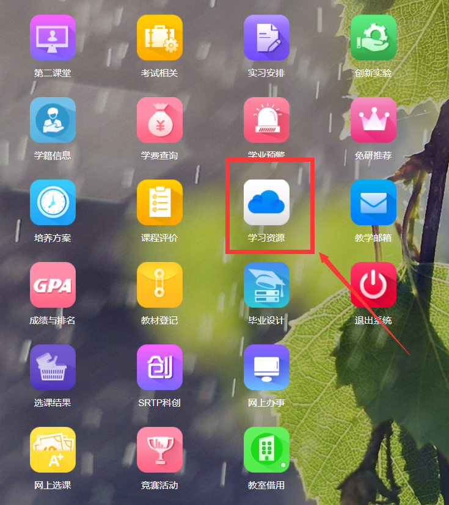
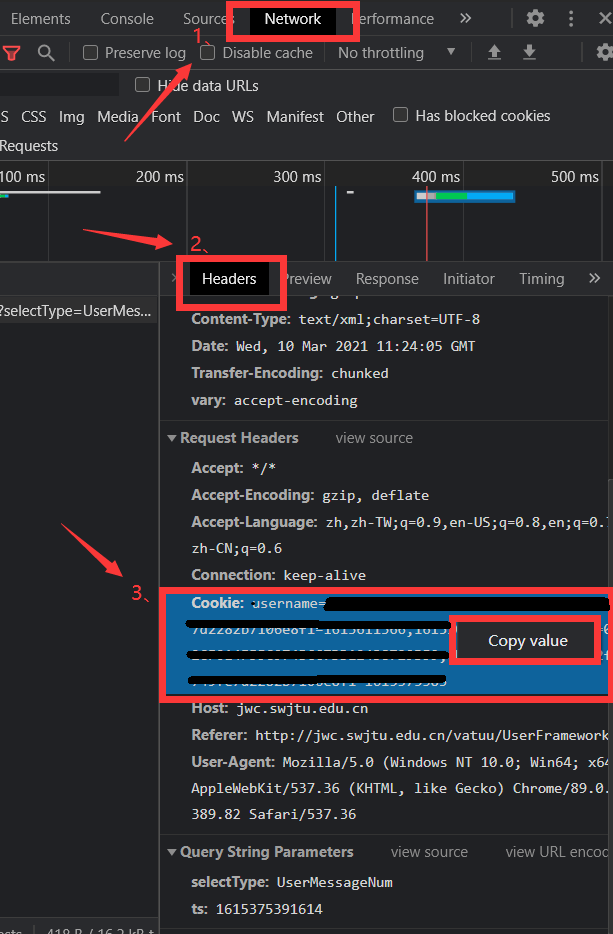
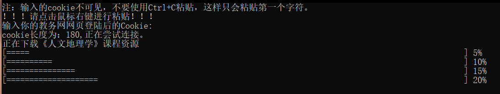
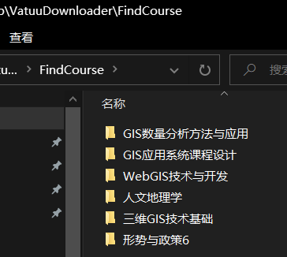

# SWJTU-当前学期课程资源一键下载

## 使用教程：

### 1、获取当前用户cookie

首先登陆学校教务网，登陆成功后点击【F12】后如下图所示操作获取Cookie

### 2、输入Cookie到软件中

复制Cookie后，双击打开VatuuDownloader.exe文件，点击鼠标右键一次，回车即可开始执行下载。以下为正常运行界面。

> 如果没有执行成功，请确认Cookie是否是最新的并且没有复制错误。
>
> 并且请注意不要使用Ctrl+V粘贴！！！
>
> 直接右键点击一次即可！！！

最终下载的文件在你执行目录下的【FindCourse】文件夹内。

